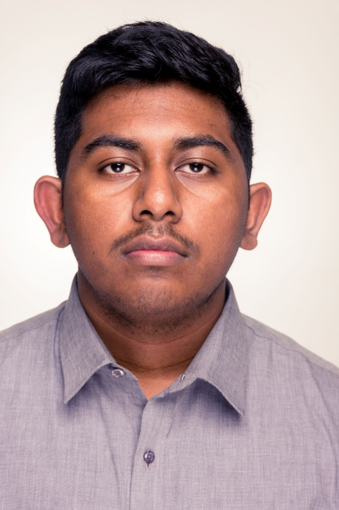

# CSE1105 Template Repository

This a template repository to help you get started on making the best project possible!

You can download the latest version [here](https://github.com/SERG-Delft/TI1216/releases)

http://stackoverflow.com/a/6466993

## How to import into your IDE

Eclipse:
[http://javapapers.com/java/import-maven-project-into-eclipse/](http://javapapers.com/java/import-maven-project-into-eclipse/)

Intellij:  
[https://www.jetbrains.com/help/idea/2016.2/importing-project-from-maven-model.html](https://www.jetbrains.com/help/idea/2016.2/importing-project-from-maven-model.html)
=======

Alessandra Santi
netid: asanti
Strong points:
- Orgazination and planning skills
- Motivation

Weak points:
- I don't have prior knownledge of programming

My goal for this project is not only to be a better programmer, but to be a better computer scientist. Aiming to be responsible for my ideas and respectful of others'. My reality starts from very poor backgroud in progrommaning but I am motivated to be the best version of me in relation to the project and my teammates. I strongly believe that working with people with different mindset and backgrounds will be an incredible opportunity to achieve my, and hopefully, everyone's goal. I am willing to listen and pay attention to make sure I learn everything I can.
The most concrete observation I can make about how I am going to reach my goal is definatly relying upond planning and commitment. I believe that sticking to a pre-made schedule is not only going to allow us to stay on track but it will give me time to dig deeper in the matter treated.

inika (Ioanna Nika)

Strong Points
•	Responsible 
•	Quick Learner 
•	Able to adapt to different situations 

Weak Points
•	Selfish
•	Impatient

What I would like to gain from that project and set as a personal goal is first of all to learn to work efficiently in a team.
It’s generally not always easy to cooperate and communicate with people in order to keep a project in track. It needs from all
the members to be responsible,patient,organized and of course ready to help each other.Furthermore, I would like to become a 
better programmer and improve my skills in software engineering. I see the project as a great opportunity to learn as much as
possible about java and the other programs we need to work with.During this project i would like to learn more about testing,
how to test efficiently and what does it mean to be a responsible programmer.I believe that in order to complete the project 
each one of us will have to work on their teamwork and programming skills.

Eliott Afriat  eafriat  
I would Lioke to work on my comunication skills. 
Issues:
    I am bad at replying to messages on whatsap and such.
    I speak to fast / dont articulate
    I cut people off
    I dont express my thoughts clearly
Being better at comunicationg would be very important in day to day life, but also in my future career, 
Being good at comunicating what you are thinking is a important quality in an engeneer, and is probably what I am strugeling most with.
To accomplish this I will need to be more alert with messages, reponding promptly whene relevant.
And durring team meating I will need to pay special attention to making sure I am being understood and that I am helping other thoughts from my own being heard.

Rayan Rakibuzzaman netid :rrakibuzzaman

Weak points
•	Procrastinates a lot
•	Slow learner

Strong Points
•	Likes to finish what’s started
•	Patient

I would like to learn several things from this project including learning to work in a team, being more responsible 
(as others depend on my feedback), doing some actual work to achieve a goal.On the academic side, I would like to
learn to program better(Java), solving complex layered problems and gain insight on programs like Git. I would also
like to learn how to test better(and efficiently) an actual working program that other people might use.

Rico van Leeuwen 
  netid: ricovanleeuwen
  
During this project, my main learning goal is improving my communication skills.
Communication is not only an important part of this project, but also for my future carreer and during all kind of other events during my life.
Currently, I have trouble expressing my thoughts clearly, wich leads to my just giving up on trying to explain it and going with something else. 
I also hold off asking something I am not sure about or don't know to someone else and instead waste a lot of time figuring it out on my own. 
I plan on improving this by asking help from my teammates earlier when I notice I waste too much time on something and by not giving up so early on expressing my thoughts.

Anoek Winkelman  

Develop a goal:
+ I think I can either lead a team or follow depending on what a team needs.
+ I am a hard worker and I am willing to put the time in to reach my goal.
- I tend to fall too much back in helping develop the project if it seems 
like other people are much better in whatever we are trying to achieve than me.
- Sometimes I get too absorbed into a project and time spend on other projects become less and less as
I become more invested in the one project.

Create plan to achieve your goal:
I hope I will be able to learn a lot about programming java in this group. I'm really excited
to learn from others and their experiences. I hope git will also be less of a mystery to me at the end of the
project.
This is important to me because I think it's part of CSE's core to program well and willingness to learn 
from others. Git is not that important to me personally, but I think it would make things easier.
For programming java and learning from others, the goal is never really reached since technology will keep
on developing. For git I think at the end of the project I probably will understand it well enough to serve me.

I like to think I am actively working on this goal? It should be since I am actively doing the group work
and am excited for the project. You can always do more, but there is also a limit to your time and
energy. Both of those should also go into the other courses. I could try harder but I'm actually pretty 
comfortable with the amount of time and energy put into learning how to program.

Currently I'm just using the project as a crutch to grow further. I can use stackoverflow and teammates 
to learn more. I'm also very excited to learn more ways to improve my programming. The only thing in my way 
is practice and time.

Ioana Paula Iacoban netid: iiacoban  

Goal:  Improve organization, teamwork skills and work flexibility 

Strong points: motivated, excited  

Weaker points: impatient, disorganized 

I see this project as a great opportunity to improve the skills I developed so far and become a better programmer by doing lots of research, 
experiment and exchange ideas with the team. So far, my experience with programming is mainly based on what I have learned during the first semester. 
After the project, I want to know how the whole process of implementing an application looks like and what are the required steps. 
Furthermore, acquiring more knowledge of java and developing a programmer's perspective on problem solving is also on my list. 
Moreover, I plan to improve my teamwork and social skills by working with my team mates, discuss all sorts of aspects and find solutions together.

