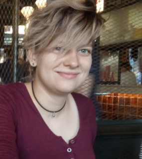

Eliott Afriat   

Ioana Paula Iacoban

=======
Ioanna Nika

=======
Alessandra Santi 
Rico van Leeuwen  

Anoek Winkelman  
Develop a goal:
+ I think I can either lead a team or follow depending on what a team needs.
+ I am a hard worker and I am willing to put the time in to reach my goal.
- I tend to fall too much back in helping develop the project if it seems 
like other people are much better in whatever we are trying to achieve than me.
- Sometimes I get too absorbed into a project and time spend on other projects become less and less as
I become more invested in the one project.

Create plan to achieve your goal:
I hope I will be able to learn a lot about programming java in this group. I'm really excited
to learn from others and their experiences. I hope git will also be less of a mystery to me at the end of the
project.
This is important to me because I think it's part of CSE's core to program well and willingness to learn 
from others. Git is not that important to me personally, but I think it would make things easier.
For programming java and learning from others, the goal is never really reached since technology will keep
on developing. For git I think at the end of the project I probably will understand it well enough to serve me.

I like to think I am actively working on this goal? It should be since I am actively doing the group work
and am excited for the project. You can always do more, but there is also a limit to your time and
energy. Both of those should also go into the other courses. I could try harder but I'm actually pretty 
comfortable with the amount of time and energy put into learning how to program.

Currently I'm just using the project as a crutch to grow further. I can use stackoverflow and teammates 
to learn more. I'm also very excited to learn more ways to improve my programming. The only thing in my way 
is practice and time.
